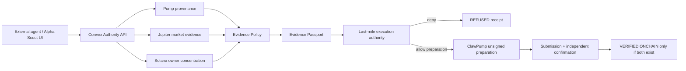

<p align="center">
  
</p>

<h1 align="center">Alpha Scout</h1>

<p align="center"><strong>The evidence can say no.</strong></p>
<p align="center">Evidence underwriting and execution authority for autonomous capital on Solana.</p>

<p align="center">
  <a href="https://f87de3e2.alpha-scout-clawrena.pages.dev"><strong>Validated Preview</strong></a>
  ·
  <a href="https://f87de3e2.alpha-scout-clawrena.pages.dev/proof"><strong>Proof Room</strong></a>
  ·
  <a href="https://grandiose-poodle-700.convex.site/authority-policy"><strong>Authority Policy</strong></a>
  ·
  <a href="https://grandiose-poodle-700.convex.site/authority-openapi"><strong>OpenAPI</strong></a>
</p>

<p align="center"><sub>AnsemHack / Clawrena · Public preview · PAPER trading harness · no verified on-chain volume claimed</sub></p>

> **Current status**  
> The public Cloudflare preview and live Convex authority backend are reachable now. A real Pump launch has been independently underwritten and refused because critical evidence remained unknown; the stored Evidence Passport recomputes to the same replay key and `valueMovement` stayed `false`. Final production routing, tokenization, and external hackathon eligibility are handled separately and are not claimed complete here.

---

## Why Alpha Scout exists

### The pain

Autonomous trading agents are good at finding things to act on. The dangerous part is what happens **between a market signal and moving value**.

A scanner can say a token looks interesting. A model can say the momentum looks strong. Neither statement proves that launch provenance is real, liquidity is sufficient, ownership concentration is known, the evidence is fresh, or the execution provider is healthy.

### The problem

Most agent stacks blur several different decisions together:

- discovery;
- analysis;
- recommendation;
- authorization;
- execution;
- confirmation.

That makes it too easy for an incomplete observation, an unresolved `UNKNOWN`, or a stale recommendation to become accidental authority.

### Why Alpha Scout is different

Alpha Scout is an **Evidence Underwriter / Execution Authority**. It sits between the signal and the money.

- It verifies Pump launch provenance from real transaction instructions.
- It fetches live market evidence independently instead of trusting caller-provided scores.
- It keeps critical `UNKNOWN` states visible and fail-closed.
- It applies a versioned deterministic evidence policy.
- It produces replayable **Evidence Passports** with reasons, blockers, freshness, and counterfactuals.
- It separates `QUALIFIED` from final execution authorization.
- It requires a fresh receipt and live provider preflight before last-mile preparation.
- It never counts activity as verified on-chain volume without a transaction signature **and** independent confirmation slot.

**Signal → Underwrite → Evidence Passport → Last-mile authority → Prepare / Refuse → Verify**

The central invariant is simple: **recommendation is not authority**.

---

## The authority flow

| Step | What happens |
|---|---|
| Discover | Find a candidate from live Pump / Solana observations |
| Underwrite | Re-fetch provenance, price, liquidity and ownership evidence |
| Decide | Produce `QUALIFIED` or `REFUSED` under the versioned policy |
| Passport | Persist replay key, source ledger, blockers, unknowns and freshness |
| Last mile | Re-check receipt freshness, provider health and risk budget |
| Verify | Keep PAPER, PREPARED, pending on-chain and VERIFIED ONCHAIN distinct |

The strongest outcome is not always a trade. A correct refusal is a successful authority decision.

---

## Execution architecture



- **React / Vite** provides the workstation and Proof Room.
- **Convex** stores decisions, source lineage, replay keys, agent state, paper portfolio state, and public authority endpoints.
- **Solana RPC / Helius** supplies launch and ownership evidence.
- **Jupiter Price V3** supplies live price/liquidity evidence.
- **ClawPump** is the external agent / preparation surface; its safety gates are never silently bypassed.
- **Evidence Policy `AS-AUTHORITY-V1`** centralizes thresholds, scoring, critical unknowns, and freshness.

See [`docs/ARCHITECTURE.md`](docs/ARCHITECTURE.md) for the compact technical map.

---

## Evidence

### Real negative path

A real Pump launch was evaluated from live evidence and **refused** because holder concentration remained unknown. The decision was persisted with a source ledger and deterministic replay key. No value moved.

### External-agent authority proof

A separate Claude Code agent called Alpha Scout against a real Pump launch. Alpha Scout independently evaluated the evidence and stored the result:

| Field | Result |
|---|---|
| Authority decision | `REFUSED` |
| Evidence score | `30/100` |
| Replay key | `AS1-51fff2964ef6c06d` |
| Replay consistency | `MATCH` |
| Critical unknown | `largest-holder concentration` |
| Value movement | `false` |
| Caller identity | Declared context, **not** cryptographic identity proof |

The Proof Room exposes the same receipt, requester context, source ledger, blockers, unknowns, and replay result in a judge-facing interface.

Canonical public evidence lives under [`evidence/canonical-run/`](evidence/canonical-run/). Runtime reachability is captured in [`evidence/runtime/LATEST.json`](evidence/runtime/LATEST.json).

See [`docs/AUTHORITY_PROOF.md`](docs/AUTHORITY_PROOF.md) for the evidence boundaries.

---

## Product surfaces

- `/` — product thesis and authority model
- `/proof` — Proof-of-Authority Workstation with live stored receipt replay
- `/dashboard` — PAPER portfolio and separated execution records
- `/signals` — live launch / signal feed
- `/agent` — agent controls, ClawPump link and Agent Treasury observability
- `/token/:mint?` — live token shield scan

---

## Agent-facing authority API

The live Convex HTTP surface exposes:

- `GET /healthz` — backend health
- `GET /authority-policy` — current policy version and thresholds
- `GET /authority-openapi` — machine-readable integration contract
- `GET /authority-stats` — request activity only; explicitly not unique users, volume, or realised performance
- `POST /underwrite` — independent underwriting for a Pump launch
- `POST /reunderwrite` — server-bound re-evaluation of a stored prior decision

A reusable integration skill is included under [`skills/evidence-authority/`](skills/evidence-authority/).

---

## Token utility

Alpha Scout does not invent governance or holder yield to justify a token.

ClawPump exposes creator-fee economics for agent-linked tokens, and Alpha Scout surfaces that as **Agent Treasury observability**. The UI can show earned, sent, pending and held creator-fee state from the public ledger.

What is **not** claimed:

- holder revenue sharing;
- guaranteed yield or appreciation;
- buybacks / burns;
- governance rights;
- automatic spending of creator fees;
- a live Alpha Scout token before an actual tokenization receipt exists.

See [`docs/TOKEN_UTILITY.md`](docs/TOKEN_UTILITY.md).

---

## Truth boundaries

Alpha Scout deliberately keeps these states separate:

- `OBSERVED ≠ INFERRED`
- `UNKNOWN ≠ PASS`
- `QUALIFIED ≠ AUTHORIZED`
- `PREPARED ≠ SUBMITTED`
- `SUBMITTED ≠ VERIFIED ONCHAIN`
- `REPLAY MATCH ≠ CRYPTOGRAPHIC ATTESTATION`
- caller metadata ≠ verified identity
- underwriting activity ≠ unique users, trading volume, or realised performance

The current trading harness remains **PAPER**. Verified on-chain volume is only counted when a real on-chain transaction has both a signature and an independently stored confirmation slot.

Real-world failure cases that shaped these boundaries are documented in [`docs/REAL_FAILURE_EVIDENCE.md`](docs/REAL_FAILURE_EVIDENCE.md).

---

## Security model

- Browser-visible `VITE_*` configuration never contains backend secrets.
- Underwriting mutation endpoints can require a server-side authority API key.
- Wallet observation never becomes synthetic paper buying power.
- Signal claims use an atomic lease to prevent duplicate concurrent execution.
- Critical evidence gaps fail closed.
- Passing Evidence Passports expire before last-mile execution.
- ClawPump high-risk / unverified acknowledgements are never silently bypassed.
- Provider degradation can deny execution preparation.

See [`SECURITY.md`](SECURITY.md) and [`docs/DEPLOYMENT.md`](docs/DEPLOYMENT.md).

---

## Repository guide

The public `master` branch is intentionally compact for judges and contributors:

- `src/` — browser product surfaces
- `convex/` — authority backend, evidence policy, market reads and durable state
- `skills/` — reusable evidence-authority integration skill
- `evidence/` — compact runtime and canonical proof artifacts
- `docs/` — architecture, deployment, evidence and token-utility documentation
- `scripts/` — integrity, logic, runtime-capture and submission-readiness utilities
- `public/` — static assets and Cloudflare routing headers

Internal research, competitive analysis, design process notes, operational handovers, transcript analysis, and strategy work are intentionally **not part of the current public tree**.

---

## Development

```bash
npm ci
npm run verify:integrity
npm run test:logic
npm run typecheck
npm run lint
npm run build
```

Local configuration starts from `.env.example`. Backend secrets belong in the Convex deployment environment, never in browser-visible `VITE_*` variables.

---

## Team

- **Faadil1** — product / repo lead
- **Opeyemi (`opeblow`)** — collaborator / technical lead

---

## Useful links

- [Validated Cloudflare preview](https://f87de3e2.alpha-scout-clawrena.pages.dev)
- [Proof Room](https://f87de3e2.alpha-scout-clawrena.pages.dev/proof)
- [Authority policy](https://grandiose-poodle-700.convex.site/authority-policy)
- [Authority OpenAPI](https://grandiose-poodle-700.convex.site/authority-openapi)
- [Architecture](docs/ARCHITECTURE.md)
- [Authority proof](docs/AUTHORITY_PROOF.md)
- [Token utility](docs/TOKEN_UTILITY.md)
- [Security](SECURITY.md)

## License

MIT — see [`LICENSE`](LICENSE).
