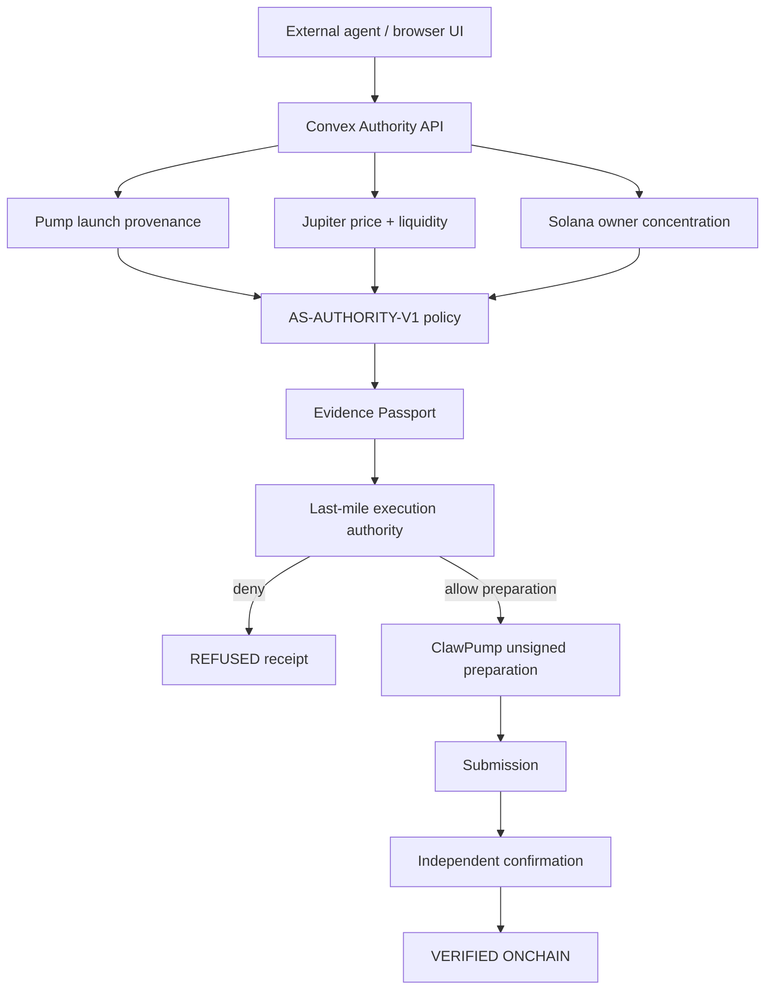

# Alpha Scout architecture

Alpha Scout is an evidence-underwriting and execution-authority layer for autonomous capital on Solana.

Its core job is to keep discovery, evidence, authorization, preparation, execution and verification separate.

## Frontend

The React/Vite application exposes the landing page, Proof Room, dashboard, signal feed, agent console and token shield.

The browser receives only public Convex configuration. Secrets never belong in `VITE_*` variables.

## Authority backend

Convex provides:

- durable underwriting decisions;
- replay-key lookup;
- decision lineage for re-underwriting;
- evidence and source ledgers;
- policy versioning;
- agent and PAPER portfolio state;
- public authority endpoints;
- last-mile ClawPump preparation checks.

The public HTTP surface is defined in `convex/http.ts`.

## Evidence policy

`convex/lib/evidencePolicy.ts` defines the canonical policy contract, including:

- liquidity thresholds;
- evidence score thresholds;
- critical unknowns;
- Evidence Passport freshness;
- deterministic scoring weights.

`QUALIFIED` means the evidence gate passed. It does **not** mean execution is authorized.

## Market evidence

Alpha Scout independently reads:

- Pump `create` / `create_v2` transaction provenance;
- Jupiter market evidence;
- Solana token-account ownership and concentration;
- provider health before last-mile preparation.

Caller-provided scores never become underwriting authority.

## Evidence Passport

Each stored decision can include:

- policy version;
- policy state;
- replay key;
- evidence freshness expiry;
- source ledger;
- reasons;
- blockers;
- unknowns;
- counterfactuals.

Re-underwriting produces lineage rather than editing old decisions.

## Execution states

Alpha Scout keeps these states distinct:

`PAPER → QUALIFIED → PREPARED → SUBMITTED → VERIFIED ONCHAIN`

A step never implies the next one.

Verified on-chain activity requires both a transaction signature and an independently stored confirmation slot.

## Runtime

The validated public preview uses:

- Cloudflare Pages for the Vite frontend;
- Convex for the backend and HTTP authority API;
- Solana RPC / Helius for chain evidence;
- Jupiter Price V3 for market evidence;
- ClawPump for linked-agent and unsigned-preparation paths.

See [`DEPLOYMENT.md`](DEPLOYMENT.md) for deployment details and [`AUTHORITY_PROOF.md`](AUTHORITY_PROOF.md) for the public evidence path.
